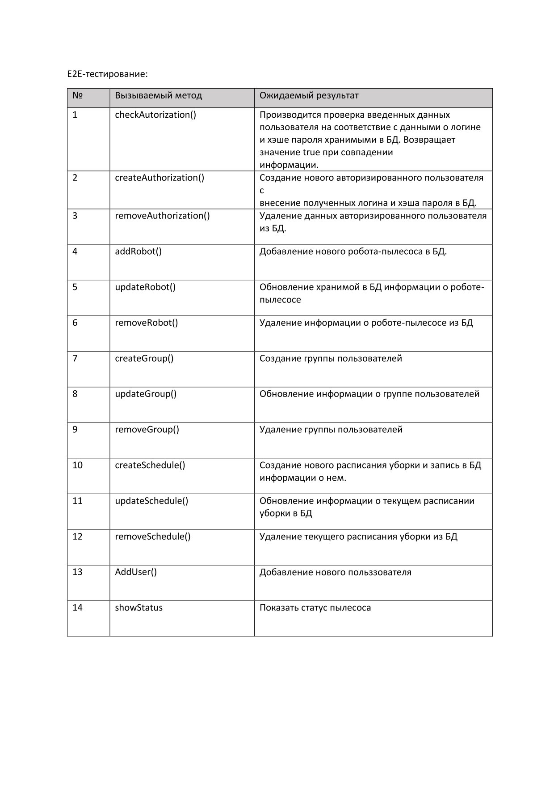
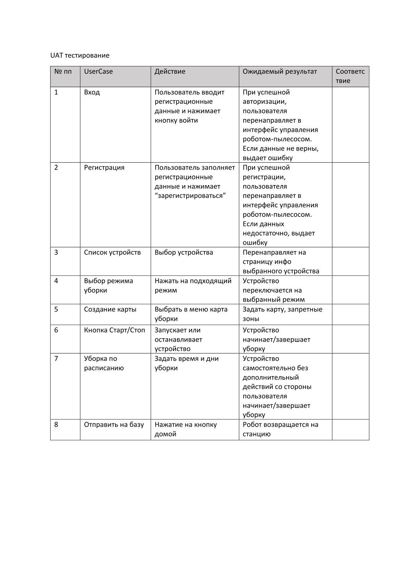

### Урок 12. Принципы тестирования приложений
Задание (см. Блок 3) : https://docs.google.com/document/d/1y5JSe2Vk64ed7c1IE6XRSYfMTzHGm7g2q-f0jRAo6eg/edit#heading=h.9uk02kr00e58

Доработать пункты задания m, n, o, p.

Инструменты:
https://app.diagrams.net/
https://www.gurock.com/testrail/
https://www.postman.com/
Сделать ревью всех пунктов последних трех семинаров (a-p)

Данная промежуточная аттестация оценивается по системе "зачет" / "не зачет"

"Зачет" ставится, если слушатель успешно выполнил
"Незачет" ставится, если слушатель успешно выполнил

Критерии оценивания:
Слушатель написал протокол UAT тестирования системы управления роботом пылесосом.

